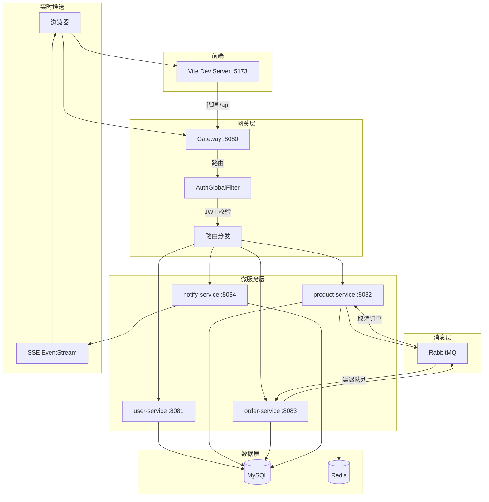
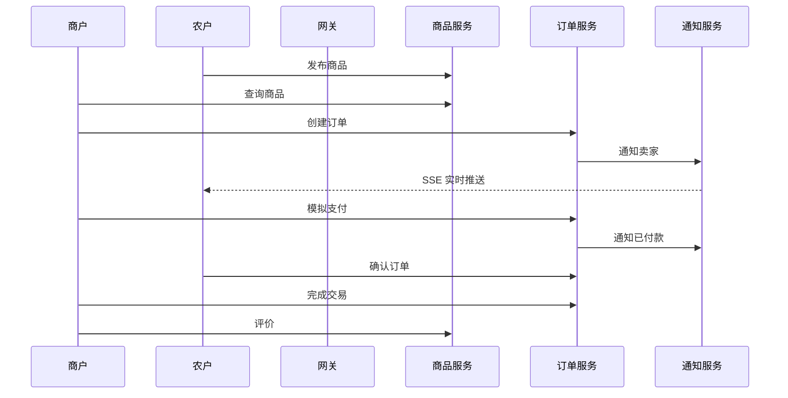
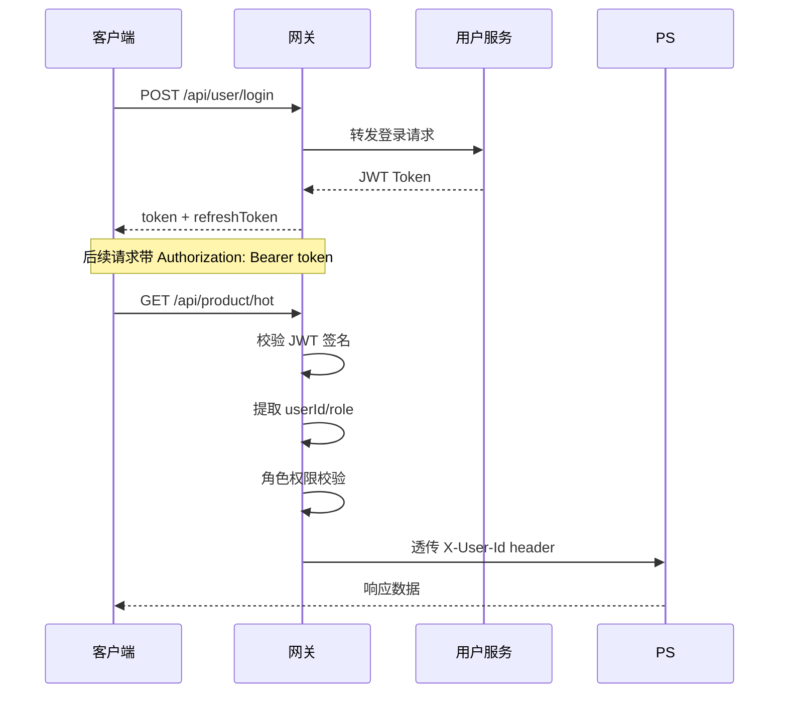
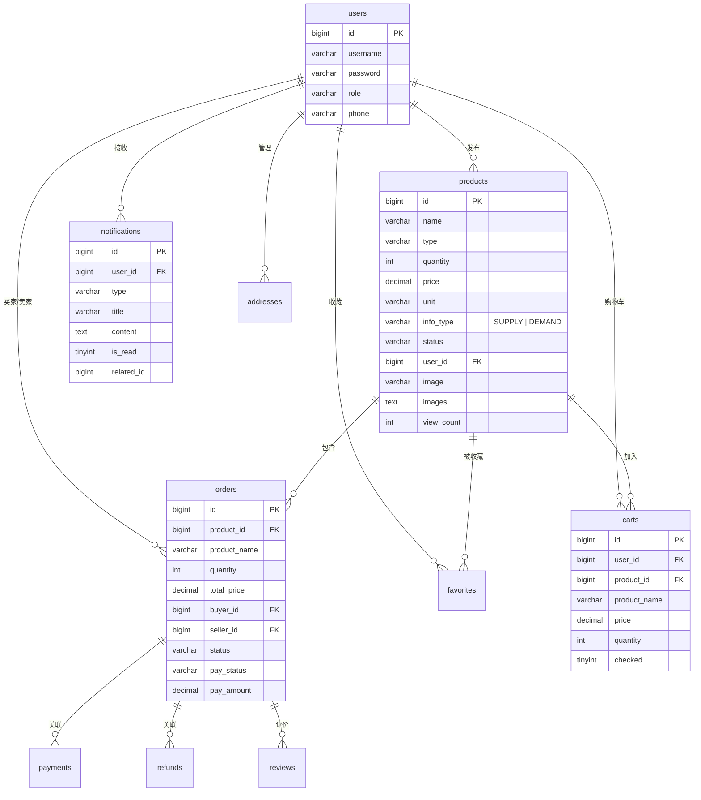

# 系统架构

## 整体架构

## 微服务职责

| 服务 | 端口 | 职责 |
|------|------|------|
| **gateway** | 8080 | 路由转发、JWT 鉴权、角色校验、CORS |
| **user-service** | 8081 | 用户注册/登录、地址管理、RBAC 权限 |
| **product-service** | 8082 | 商品 CRUD、多条件搜索、收藏、评价、文件上传 |
| **order-service** | 8083 | 订单流转、支付模拟、退款流程、购物车 |
| **notify-service** | 8084 | 通知创建/查询/已读、SSE 实时推送 |

## 数据流

### 交易流程

### 认证流程

## 数据库 ER 图

## 缓存策略

| 数据 | 策略 | TTL |
|------|------|-----|
| 产品详情 | 三级缓存（缓存 → 空值标记 → 互斥锁） | 30min |
| 热门产品 | Redis List | 5min |
| 产品类型 | Redis Set | 1h |
| 查询结果 | Redis String | 120s |
| 浏览量 | Redis 原子计数，定时落库 | - |

## 消息队列

| 队列 | 用途 | 类型 |
|------|------|------|
| order.delay | 订单超时取消 | 延迟队列 (DLX) |
| order.cancel | 取消订单后恢复库存 | 普通队列 |
| order.notify | 订单状态变更通知 | 普通队列 |
